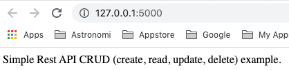

# RestApi_CRUD
Simple Rest API CRUD (create, read, update, delete) example

**Requirements:**
- An IDE (i.e. PyCharm https://www.jetbrains.com/pycharm/)
- Postman https://www.postman.com/

**How to use:**
- Clone code
- Open project with PyCharm
- Run main.py
- Open http://127.0.0.1:5000/ on your browser
- All is well if you see this text:

- Open Postman
- Import PostmanCollection.postman_collection.json to workspace
- You will see all methods (create, read, etc.) implemented in main.py ready to try
